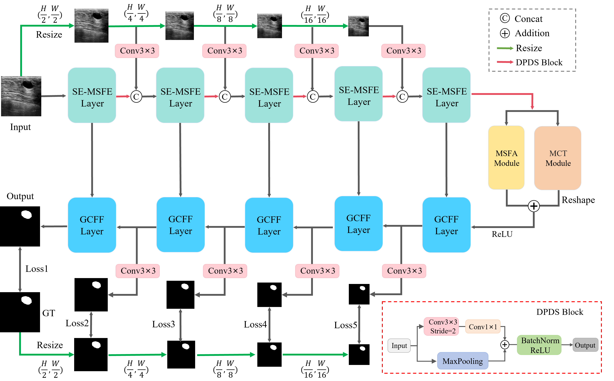

# MSAGHNet
This is the repository for 'A Multi-Resolution Hybrid CNN-Transformer Network with Scale-Guided Attention for Medical Image Segmentation'

# Architecture

# Dataset Structure
The dataset is organized as follows:

 - `data/`
    - `dataset_name/`: Name of the dataset used, such as BUSI, KvasirSEG, PanSeg, and Sliver
        - `train/`: Contains training dataset
          - `img/`: Training images
          - `mask/`: Corresponding segmentation masks for training images
        - `test/`: Contains training dataset
          - `img/`: Test images
          - `mask/`: Corresponding segmentation masks for test images
          
        - `val/`: Contains validation dataset
          - `img/`: Validation images
          - `mask/`: Corresponding segmentation masks for validation images
            
    - `dataset_name/`: Name of the dataset used, such as BUSI, KvasirSEG, PanSeg, and Sliver
       - .......

# Train and Test
Please use Train.py and Test.py for model training and prediction. 

# Datasets
The following datasets are used in this experiment:
<ol>
  <li><a href="https://scholar.cu.edu.eg/?q=afahmy/pages/dataset/">BUSI</a></li>
  <li><a href="https://datasets.simula.no/kvasir-seg/">KvasirSEG</a></li>
  <li><a href="https://osf.io/kysnj/">PanSeg</a></li>
  <li><a href="https://sliver07.grand-challenge.org/">Sliver</a></li>
 </ol>

# Citation
Please cite the following reference if you use this code.
@article{zhu2025multi,
  title={A Multi-Resolution Hybrid CNN-Transformer Network With Scale-Guided Attention for Medical Image Segmentation},
  author={Zhu, Shujin and Li, Yue and Dai, Xiubin and Mao, Tianyi and Wei, Lei and Yan, Yidan},
  journal={IEEE Journal of Biomedical and Health Informatics},
  year={2025},
  publisher={IEEE}
}
